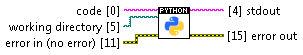

Execute In Python.vi
====================

Runs code in `Python <https://www.python.org/>`_ interpreter. Interpreter is called synchronously.

Interpreter must be available for underlying shell. For users of Windows this means that path to the directory with interpreter should appear in ``PATH`` variable of the operating system.

VI has been tested with IPython 3.5.1 from Anaconda 2.5.0 under Windows 7, 64 bit. Even though, multiple other interpreters are acceptable too. The requirement is that interpreter should accept ``-`` (minus) as the name of input script and consider it as stdin.

**code** *(Input, String)*
  Code to be executed.

**working directory** *(Input, Path)*
  Working directory of Python interpreter.

**stdout** *(Output, String)*
  stdout (standard output) of Python interpreter.

**error in** *(Input, Error Cluster)*
  This input provides standard `error in <https://zone.ni.com/reference/en-XX/help/371361L-01/lvconcepts/using_standard_error_in/>`_ functionality.

**error out** *(Output, Error Cluster)*
  stderr (standard error) of Python interpreter becomes a message in the error cluster. Return code of Python interpreter becomes a code in the error cluster. If return code is different than 0, status in the error cluster becomes True.

