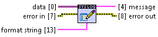

Write To Sys Log.vi
===================

Uses Win32 OutputDebugString system call for sending text to the system log. System log can be monitored in real time by `DebugView <http://technet.microsoft.com/en-us/sysinternals/bb896647.aspx>`_. Next sections describe two options of using DebugView.

Conditional disable symbol ``SYSLOG_ENABLED`` bust be set to ``TRUE`` it order to enable this VI. Otherwise, VI becames removed from the code at compile time and doesn't introduce any overhead.

This VI is usable only under Windows operating systems.

**data** *(Input, Variant)*
  Data to be converted into string and written to the system log.

**format string** *(Input, String)*
  Optional string that specifies how to create resulting string. See `Format Container Into String <http://lv-string-utils.readthedocs.io/en/latest/format_container_into_string.html>`_ to learn more about formating.

**message** *(Output, String)*
  Formated string that is written to the system log.

**error in** *(Input, Error Cluster)*
  This input is connected directly to **error out**. VI executes even if **error in** contains an error.

**error out** *(Output, Error Cluster)*
  This output is connected directly to **error in**. VI itself never outputs any errors.

Local Debugging
---------------

DebugView and user's application work under the same operating system.

1. Simply start:

::

    Dbgview.exe

Remote Debugging
----------------

DebugView and user's application work under different operating systems.

1. On the target site start:

::

    Dbgview.exe /a /s

2. On the client site start:

::

    Dbgview.exe

3. Go to Menu->Computer->Connect.

4. Type hostname of the target computer and click `OK`.

